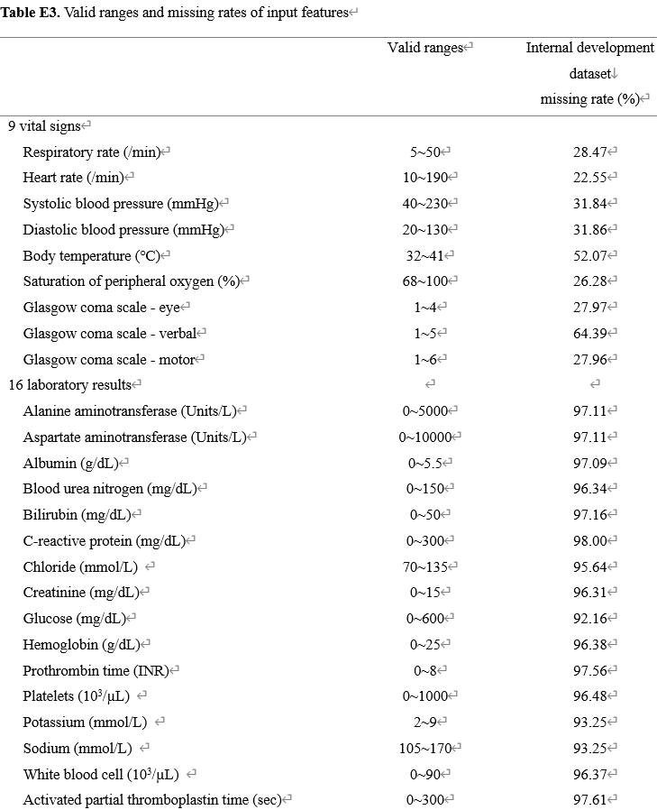
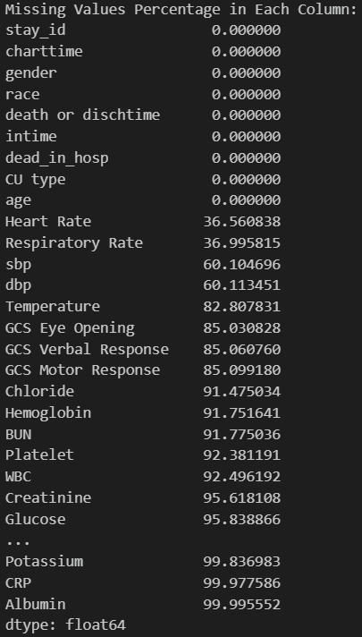
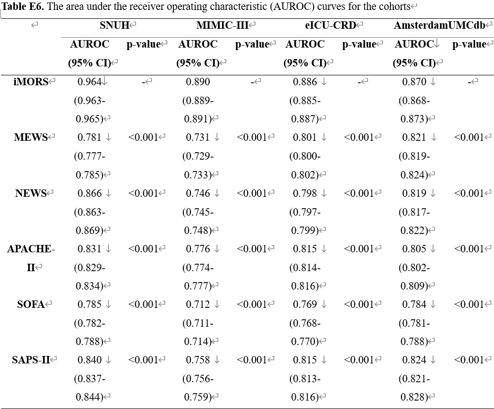

- [ ]  논문 정보
- 논문명 : Real-time machine learning model to predict short-term mortality in critically ill patients: development and international validation
- 저널명 : Critical Care
- 게재일 : 2024년 3월 14일
- 원문 : https://ccforum.biomedcentral.com/articles/10.1186/s13054-024-04866-7#Sec11

### **data**



논문에서의 missing rate 



mimic-iv data cleansing 후의 missing rate

- selected feature:
    - **hosp schema - admissions table**: ‘death or disch time’, ’race’, **patients table**: 'gender', 'age'
    - **9 vital signs**: ‘respiratory_rate’, 'heart rate', 'sbp', 'dbp', 'temperature', ‘SpO2’, 'gcs eye', 'gcs verbal', 'gcs motor’
    - **16 laboratory results**: 'ALT', 'AST', 'albumin', 'bun', 'bilirubin', 'crp', 'chloride', 'creatinine', 'glucose', 'hemoglobin', 'platelets', 'potassium', 'prothrombin time', 'sodium',
    'temperature', 'wbc'
        
        ※원 논문은 학습 코호트로 자체 병원 데이터 및 MIMIC-3을 사용 → 표본 및 feature의 차이가 존재(연명치료 거부 여부 확인 불가, Aptt 변수 사용 불가 등)
        
        - dataset:
            - **stay_id** ICU 입실 고유코드(index)
            **race** 인종 → 6개 카테고리로 재분류
            **gender** 성별 
            **age**	입원 당시 연령(39세 이하 제외)
            **los** ICU 체류시간(60일 이상 제외)
            **CU type** 중환자실 종류(마지막 기준)
            **charttime** 데이터 측정 시간
            **label** 측정 대상값
            **value** 측정 수치
            **dead_in_hosp** 원내 사망 여부(0/1)
            

<aside>
💡 **dataset 특징점**

1. 측정시점 데이터로 **charttime 채택**
2. **결측치 처리**: stay_id별로 forward fill 적용, 첫 행이 결측치일 경우 전체의 median 값 채택
3. **los**(length of stay): charttime(측정시각)-intime(입실시각)으로 수정
4. negative 값 downsampling: random 시점 선택 후 **해당 시점 전후 24시간** 값만 채택
5. negative random downsampling을 통해 positive-negative 비율을 50~52:47~49로 고정(valid, test set에서도 동일하게 유지)
</aside>

- 6737 stay_id, 161688 측정건을 train:valid:test=7:2:1 로 분리 ⇒ 24 sequence / 35 feature 구조로 모델에 입력

### model

```markdown
1. **Feature-wise fully connected layers**: 각 특성(예: 체온, 맥박, 혈압 등)에 대해 별도의 fully connected 층을 적용
2. **LSTM layers**: 시간 순서대로 정렬된 환자 데이터의 시간적 의존성을 캡처하기 위해 3개의 LSTM 층을 사용(이 층들은 환자의 건강 상태 변화를 시간에 따라 추적)
3. **Fully connected layers with ReLU**: LSTM의 마지막 출력을 받아 5개의 fully connected 층을 통과. 각 층 후에는 ReLU 활성화 함수를 적용하여 비선형성을 도입
4. **output layer**: 마지막 fully connected 층은 사망을 이진 분류로 예측하는 단일 출력.
```

LSTM(5 FC+3 LSTM layer) + LightGBM ensemble(soft voting: 모델간 가중치 없음)

- LSTM hyperparameter(selected value)
    
    
    
    - LSTM: epoch 15(early stopping), lr=5e-05, weight decay=0.001

- LightGBM hyperparameter(Optuna로 최적화)
    
    `'boosting_type': 'gbdt',
    'metric': 'binary_logloss',
    'num_leaves': 46,
    'learning_rate': 0.009956161053144313,
    'feature_fraction': 0.5176012854164608,
    'bagging_fraction': 0.6884825233029791,
    'bagging_freq': 9,
    'lambda_l1': 5.355315331951963,
    'lambda_l2': 9.728359207757496,
    'min_data_in_leaf': 222,
    'max_depth': 6`
    

### evaluation

- 평가 지표 : Accuracy, AUROC, AUPRC / test set
    
    
    |  | LSTM | LightGBM | ensemble  |
    | --- | --- | --- | --- |
    | Accuracy | 0.9267 | 0.9450 | 0.9267 |
    | AUROC | 0.9783 | 0.9868 | 0.9807 |
    | AUPRC | 0.9776 | 0.9868 | 0.9804 |
    


### limitation

- 논문에서는 cohort로 MIMIC-3, eICU-crd, UMCdb 및 자체 데이터(서울대병원) 사용하였으나, 구현에는 MIMIC-4 단독으로 사용 → dataset의 차이로 일부 feature 반영할 수 없었음

### furthermore

- another cohort dataset validation (EICU 등)